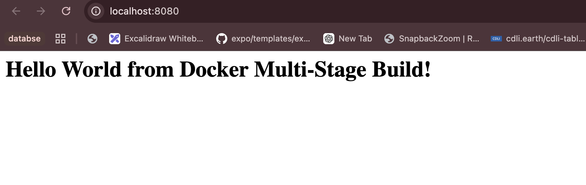
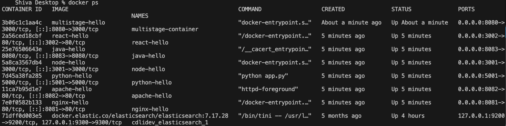

# Docker Multi-Stage Build Assignment

**Name:** Shiva Gupta
**Enrollment Number:** 10461

## Task 1: Run the multi-stage Dockerfile

I cloned the repository which has the multi-stage Dockerfile, built the image from it and ran a container from that image on port 8080.

### The multi-stage Dockerfile

```dockerfile
FROM node:24-alpine AS builder
WORKDIR /app
COPY package*.json ./
RUN npm install
COPY . .

FROM node:24-alpine AS production
WORKDIR /app
COPY --from=builder /app/package*.json ./
RUN npm install --omit=dev
COPY --from=builder /app/server.js ./
EXPOSE 3000
CMD ["npm", "start"]
```

### Build the image

```bash
docker build -t multistage-hello .
```

```
#12 [production 5/5] COPY --from=builder /app/server.js ./
#12 DONE 0.0s

#13 exporting to image
#13 exporting layers
#13 exporting layers 0.3s done
#13 exporting manifest sha256:ef962818178ced278a835f356048e54bf528c4d142edee54e12eb81ad2ff4f1d done
#13 exporting config sha256:113e2ecf3568ef6621d68ef528833da13ab3ae05b691d5128483e93623c92036 done
#13 naming to docker.io/library/multistage-hello:latest done
#13 unpacking to docker.io/library/multistage-hello:latest 0.2s done
#13 DONE 0.6s
```

### Run the container on port 8080

```bash
docker run -d --name multistage-container -p 8080:3000 multistage-hello
```

```
3b06c1c1aa4c7d01f8125bd3aac6f00890acc701d18083eedc62c33bcc3a82de
```

### Verify the container is running on port 8080

```bash
docker ps
```

```
CONTAINER ID   IMAGE              COMMAND                  CREATED         STATUS         PORTS                                         NAMES
3b06c1c1aa4c   multistage-hello   "docker-entrypoint.s…"   4 seconds ago   Up 3 seconds   0.0.0.0:8080->3000/tcp, [::]:8080->3000/tcp   multistage-container
```

The PORTS column shows 0.0.0.0:8080->3000/tcp, which means port 8080 of the machine is mapped to port 3000 inside the container.

### Access the application

```bash
curl http://localhost:8080
```

```
<h1>Hello World from Docker Multi-Stage Build!</h1>
```

The application is showing the required message, so the multi-stage build is working correctly.

## Screenshots





## Task 2: What I understood about multi-stage builds

A multi-stage Dockerfile has more than one FROM line. Each FROM starts a new stage and every stage gets its own filesystem.

In this Dockerfile the first stage is named builder. It copies package.json, runs npm install and copies the source code. This stage has all the development dependencies and the build tools.

The second stage is named production. It starts again from a clean node:24-alpine image and copies only what is needed from the first stage using COPY --from=builder. Here it copies package.json and server.js, and installs only the production dependencies using npm install --omit=dev.

The final image is made only from the last stage. Everything in the builder stage is thrown away and does not go into the final image.

The benefit is a smaller and safer image. The build tools, the dev dependencies and any temporary files stay in the first stage and never reach the image which actually runs. A smaller image is also faster to push and pull.

The final image here is 243MB. Without a multi-stage build it would be bigger because all the dev dependencies and the extra files would also be inside it.

The important instruction is COPY --from=builder, because that is how one stage takes files from another stage. Stages can also be built separately using the --target option.

## Task 3: Deploy three different types of applications

I deployed three different types of applications using Docker. The application code and the Dockerfile of each one are kept in the 05-docker folder.

| Application | Folder | Port |
|---|---|---|
| Node.js | 05-docker/nodejs-app | 3001 |
| Python | 05-docker/python-app | 5001 |
| Java | 05-docker/java-app | 8083 |

### All three running

```
$ docker ps
CONTAINER ID   IMAGE          COMMAND                  CREATED          STATUS          PORTS                                         NAMES
25e76506643e   java-hello     "/__cacert_entrypoin…"   12 minutes ago   Up 12 minutes   0.0.0.0:8083->8080/tcp, [::]:8083->8080/tcp   java-hello
5a8ca3567db4   node-hello     "docker-entrypoint.s…"   12 minutes ago   Up 12 minutes   0.0.0.0:3001->3000/tcp, [::]:3001->3000/tcp   node-hello
7d45a38fa285   python-hello   "python app.py"          12 minutes ago   Up 12 minutes   0.0.0.0:5001->5000/tcp, [::]:5001->5000/tcp   python-hello
```

### Checking each one

```
$ curl http://localhost:3001
<h1>Hello World from Node.js</h1>

$ curl http://localhost:5001
<h1>Hello World from Python</h1>

$ curl http://localhost:8083
<h1>Hello World from Java</h1>
```

All three applications are running at the same time in separate containers. Each one uses a different base image and a different port on the host, but inside the container each app uses its own normal port. This shows that Docker keeps the applications isolated from each other, so three different languages can run on one machine without any conflict.
