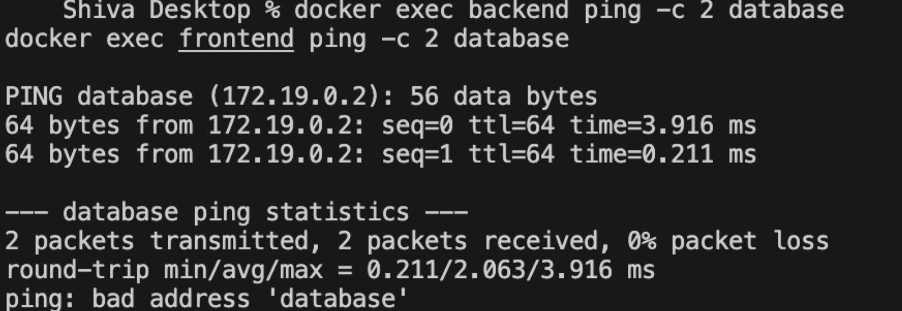
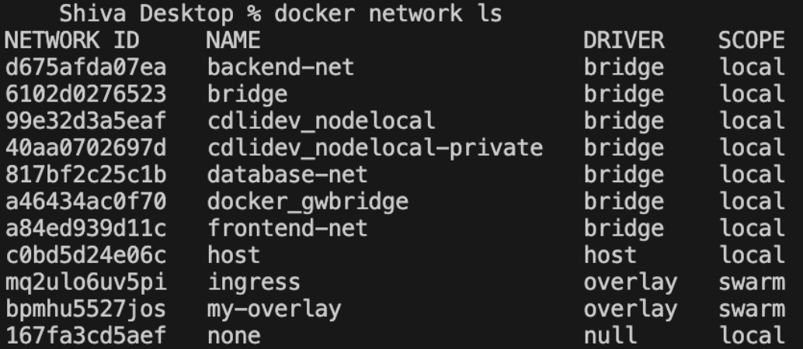

# Docker Networking and Volume Assignment

## Task 1: Docker Container Networking

I created three networks and three containers. The frontend uses the nginx image, the backend uses the alpine image and the database uses the mysql image. The backend is connected to two networks so that it can talk to both the frontend and the database.

### Create the three networks

```bash
docker network create frontend-net
docker network create backend-net
docker network create database-net
```

```
$ docker network ls
NETWORK ID     NAME           DRIVER    SCOPE
d675afda07ea   backend-net    bridge    local
6102d0276523   bridge         bridge    local
817bf2c25c1b   database-net   bridge    local
a84ed939d11c   frontend-net   bridge    local
c0bd5d24e06c   host           host      local
167fa3cd5aef   none           null      local
```

### Create the three containers

```bash
docker run -d --name frontend --network frontend-net -p 8090:80 nginx:alpine
docker run -d --name backend  --network frontend-net alpine:latest sleep 3600
docker run -d --name database --network backend-net -e MYSQL_ROOT_PASSWORD=root123 mysql:8.0
```

### Connect the backend to a second network

```bash
docker network connect backend-net backend
docker network connect database-net database
```

### Which container is on which network

```
frontend   frontend-net 
backend    backend-net frontend-net 
database   backend-net database-net 
```

The backend is on two networks, frontend-net and backend-net. So the backend can reach the frontend through frontend-net and it can reach the database through backend-net. The frontend and the database do not share any network.

### Check connectivity

```
$ docker exec backend ping -c 3 frontend
PING frontend (172.18.0.2): 56 data bytes
64 bytes from 172.18.0.2: seq=0 ttl=64 time=4.393 ms
64 bytes from 172.18.0.2: seq=1 ttl=64 time=0.390 ms
64 bytes from 172.18.0.2: seq=2 ttl=64 time=0.122 ms

--- frontend ping statistics ---
3 packets transmitted, 3 packets received, 0% packet loss
round-trip min/avg/max = 0.122/1.635/4.393 ms
```

```
$ docker exec backend ping -c 3 database
PING database (172.19.0.2): 56 data bytes
64 bytes from 172.19.0.2: seq=0 ttl=64 time=0.881 ms
64 bytes from 172.19.0.2: seq=1 ttl=64 time=0.218 ms
64 bytes from 172.19.0.2: seq=2 ttl=64 time=0.215 ms

--- database ping statistics ---
3 packets transmitted, 3 packets received, 0% packet loss
round-trip min/avg/max = 0.215/0.438/0.881 ms
```

```
$ docker exec frontend ping -c 2 database
ping: bad address 'database'
```

```
$ docker exec frontend ping -c 3 backend
PING backend (172.18.0.3): 56 data bytes
64 bytes from 172.18.0.3: seq=0 ttl=64 time=0.227 ms
64 bytes from 172.18.0.3: seq=1 ttl=64 time=0.150 ms
64 bytes from 172.18.0.3: seq=2 ttl=64 time=0.170 ms

--- backend ping statistics ---
3 packets transmitted, 3 packets received, 0% packet loss
round-trip min/avg/max = 0.150/0.182/0.227 ms
```

### Screenshots





### What I understood

Containers on the same user defined network can find each other by their container name. Docker runs its own DNS inside the network, so the name frontend is automatically resolved to the IP 172.18.0.2. This is why we do not have to hardcode any IP address.

The backend can ping both the frontend and the database because it is joined to two networks. Every network gives the container one more IP address, so the backend has one IP in the 172.18 range and another one in the 172.19 range.

The most important result is the frontend to database test. It failed with "bad address", which means the name did not even resolve. They are on different networks so Docker DNS does not give the frontend any record for the database. This is how Docker isolates containers, the database is not reachable from the frontend at all.

This is the normal way a real application is designed. The frontend talks to the backend, the backend talks to the database, and the database is never exposed to the frontend directly.

## Task 2: Host Network

### Pull the Apache image

```bash
docker pull httpd:2.4
```

```
Digest: sha256:979c38c2228d28c2edfd45c6e27dcee1c7b4a101a5526721ae8ece454e89e99e
Status: Downloaded newer image for httpd:2.4
docker.io/library/httpd:2.4
```

### Run the container using the host network

```bash
docker run -d --name apache-host --network host httpd:2.4
```

```
27925b9c8ec33c1af5cf22990402abe9bcc8291d1f3ff0130ac9afc42c0c12d9
```

```
$ docker ps
CONTAINER ID   IMAGE       COMMAND              CREATED         STATUS         PORTS     NAMES
27925b9c8ec3   httpd:2.4   "httpd-foreground"   4 seconds ago   Up 3 seconds             apache-host
```

### Access the website on port 80

```
$ curl http://localhost
<!DOCTYPE HTML PUBLIC "-//W3C//DTD HTML 4.01//EN" "http://www.w3.org/TR/html4/strict.dtd">
<html>
<head>
<title>It works! Apache httpd</title>
</head>
<body>
<p>It works!</p>
</body>
</html>
```

### What I understood

The most important thing in the docker ps output is that the PORTS column is empty. In the other tasks it showed something like 0.0.0.0:8091->80/tcp, but here there is nothing.

This is because I did not use -p at all. With the host network the container does not get its own network namespace, it directly uses the network of the machine. So when Apache listens on port 80 inside the container, it is actually listening on port 80 of the machine itself. There is no mapping and no NAT in between, which is why the website opened on http://localhost without any port number.

The advantage is speed, because the packets do not pass through Docker's NAT layer. The disadvantage is that there is no isolation and no flexibility. Two containers cannot both use port 80 on the host network, they would conflict. With a bridge network we can run many containers on port 80 inside and map them to different host ports.

Host network is used when we need maximum network performance or when an application needs to see the real network of the machine, for example some monitoring tools.

## Task 3: Bind Mount

I created a folder on the machine with an index.html file, then bind mounted that folder into an nginx container.

### Create the folder and the file

```bash
mkdir website
echo "Hello students" > website/index.html
```

```
$ cat website/index.html
Hello students
```

### Run nginx with the bind mount

```bash
docker run -d --name nginx-bind -p 8091:80 -v "$(pwd)/website:/usr/share/nginx/html" nginx:alpine
```

```
$ docker ps
CONTAINER ID   IMAGE          STATUS         PORTS                                     NAMES
eeb90d58afd1   nginx:alpine   Up 2 seconds   0.0.0.0:8091->80/tcp, [::]:8091->80/tcp   nginx-bind
```

### Check the website

```
$ curl http://localhost:8091
Hello students
```

### Change the file without restarting the container

```bash
echo "Hello students, this file was changed" > website/index.html
```

```
$ cat website/index.html
Hello students, this file was changed

$ curl http://localhost:8091
Hello students, this file was changed

$ docker ps
nginx-bind Up 2 seconds
```

### Screenshots

Before changing the file:


After changing the file, without restarting the container:


### What I understood

A bind mount joins a folder of the machine directly to a path inside the container. Here the folder website is mounted on /usr/share/nginx/html, which is the folder nginx serves its pages from.

After changing index.html the website showed the new content immediately and I did not restart the container. The docker ps output still shows the same container with the same uptime. This happens because the container is not holding a copy of the file, it is reading the same file from the machine. So whatever we edit outside is instantly visible inside.

This is very useful while developing, because we can edit the code in the editor and refresh the browser without building the image again.

The difference from a volume is that a bind mount uses a path we choose on the machine, while a volume is managed by Docker itself and stored in Docker's own area. A bind mount is good for development, and a volume is better for data that has to survive, like a database.

## Task 4: Overlay Network

### What is an overlay network

A bridge network only works inside one Docker host. If two containers are running on two different machines, a bridge network cannot connect them.

An overlay network solves this. It creates one virtual network that spreads across many Docker hosts, so a container on machine A can talk to a container on machine B using just the container name, exactly like they were on the same machine.

### Creating one

An overlay network needs swarm mode, because swarm is what keeps the network information shared between all the hosts.

```bash
docker swarm init
docker network create -d overlay --attachable my-overlay
```

```
$ docker network ls --filter driver=overlay
NETWORK ID     NAME         DRIVER    SCOPE
mq2ulo6uv5pi   ingress      overlay   swarm
bpmhu5527jos   my-overlay   overlay   swarm
```

```
$ docker network inspect my-overlay
Name: my-overlay  Driver: overlay  Scope: swarm
```

### How it works

The scope column is the main difference. A bridge network has the scope local, so it exists only on that one machine. An overlay network has the scope swarm, so every node in the swarm knows about it.

Docker uses VXLAN for this. When a container sends a packet to a container on another host, Docker wraps that packet inside a normal UDP packet, sends it over the real network to the other host, and there it is unwrapped and delivered to the correct container. This wrapping is called encapsulation, and it is why the containers feel like they are on one network even though they are on different machines.

The swarm manager keeps the list of which container is on which host, and Docker DNS uses that list, so a container name resolves correctly even across hosts.

### Use cases

Overlay networks are used when the application is running on more than one machine.

- Docker Swarm clusters, where the same service runs on several nodes
- Microservices, where each service runs on a different host but they still need to call each other by name
- Applications that need to scale, because a new container on a new machine automatically joins the same network
- Keeping traffic between services private, since the overlay traffic can also be encrypted

The ingress network in the output above is an overlay network which Docker creates by itself. It is used for the routing mesh, which lets a request come to any node of the swarm and still reach the correct container even if that container is on a different node.
